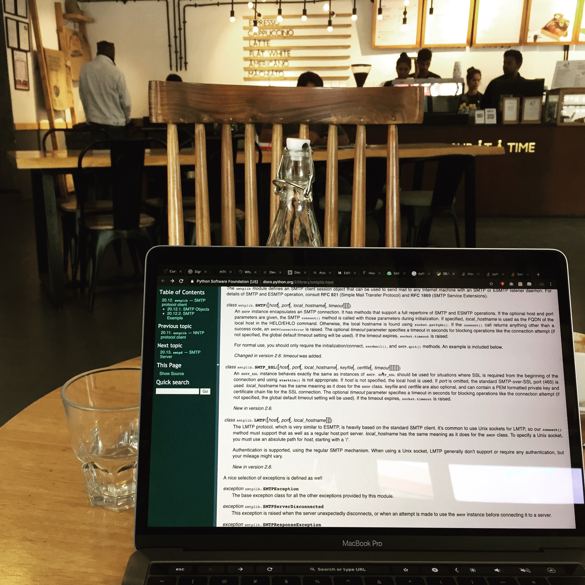

I am actively pursuing two goals right now. The first is to generate $2000 MRR from my product [Curatemails](https://curatemails.com). The second is to increase awareness and educate the masses, benefits of Email Signature Marketing.

Creating a SAAS product has always been my dream and today I am living it. But there are still miles to go.
The Beginnings

Ever since I can remember , I have always had this constant desire to create something.
College was all about [writing articles about entrepreneurs](https://yourstory.com/author/anurag-kumar/) and their journeys. As I interviewed them, it further ignited my desire to create a real valued product. I was in particular, fascinated with tech products and so I decided to create one. The only trouble, I had was practically no knowledge of how to make/code an application.

Well, the solution was simple enough.

>I taught myself how to code.

Starting from scratch is difficult when you don't have a CS background. Fortunately I found the awesome folks of [Dgplug](https://dgplug.org/archive/) who advised me to join the summer training program by [Kushal Das](https://kushaldas.in/categories/dgplug.html). 

This program was a life changing experience for me.

##Building on a good foundation

That summer training built a solid base for my career ahead. Having gained some knowledge I then spent countless number of hours in front of my laptop.
I had started applying for internships to gain exposure with real world applications. After a couple of months of my unflinching determination, I finally got an internship offer from an early stage startup. My love for working with startups grew with time and I never looked back again. For the next 4 years I ended up being the first engineer to get hired from three different startups.

>I saw what it takes to build a company.

In the process, I learned everything I could, from backend to frontend, managing servers, writing tech articles and talking to clients.
I am a slow learner and I will admit that. I took my own sweet time to move forward in life. I was building the life I wanted, one step at a time. I was not competing with anyone. Actually, I was tired of the competition throughout my school and college.

>I wanted to enjoy my life and not rush through it.

Once I figured out I had known enough to create real world applications, I started hunting for freelance projects. I was doing well in dealing with clients as I had prior experience. Experience of working with founders who taught me about building companies from scratch.

##Idea for a SAAS Product

It was during my freelancing period, I first came across the varied use of email signatures. It intrigued me, as to how a small piece of text could reveal so much about the sender. Some people were even using it to promote their products.

I wanted to create one for myself. But the problem were the tools, those were very basic. It was really difficult to use them to create reusable email signatures. I wanted to automate the entire creation process.

Being a developer I wanted something very simple, I never liked flashy images in my signatures. I wanted a minimalist yet elegant design.

>I started building a product around this idea, just to scratch my own itch.

It was 2016, I already had a full-time job and was working on freelance gigs as well. In between all these, Curatemails was born. As a side-project, I was not really very serious about it, my freelance projects were generating a side income and thus took most of my time.

Couple of years into freelancing and I realised working for others was not really my thing and I was not really happy with how my life was shaping.

I wanted to build products on the internet but with my own ideas. Working on freelance projects meant following what your client wants. Although the money was good, I was losing my passion of crafting products. It was time to end all my freelancing gigs and give full attention to my product.

>I knew what I wanted with my life and it was always to work for myself. Working on Curatemails was another step closer to that dream.

##Idea Validation

During my research with emails signatures, I realised that people were already using Email Signature Marketing Softwares for years. Companies were generating revenue with this concept of customizing email signatures. I guess my idea was validated with an an already existing market.

I had some code written by then and just needed to complete it for people to use it for their own benefit apart from me. It took me another couple of months to finish the pending code.

For the initial version I targeted independent creators. People like me who love building products. I had worked with these people for 5 years, I knew this industry.

In 2019, I finally completed a MVP of curatemails with features that suited my needs. A simple, clean and beautiful signature building tool, not feature-loaded or difficult to use. As a digital maker myself, I understand time is money, so I don't want people to waste it on designing and creating signatures. It had to be fast and quick.

Yes, it took me 3 years to finish it but it was all worth it. I learned a lot throughout this journey of creating a Saas product. As I already mentioned, I was not in a race with anyone.

-----

If you are an online creator and want to convert your email contacts into leads without any extra marketing efforts try [Curatemails](https://curatemails.com): email Signature Marketing platform made just for you.

